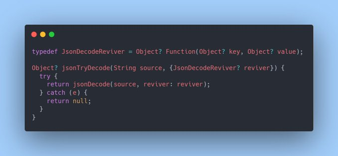

# Flutter Tips

Some tips and tricks in Flutter & Dart. 

**Inspired by [vandadnp's](https://github.com/vandadnp) repository [flutter-tips-and-tricks](https://github.com/vandadnp/flutter-tips-and-tricks)**

# Table of Contents

* [JSON decoding](#json-decoding)

# JSON decoding

[Source Code + Tests](source/json_try_decode.dart)

