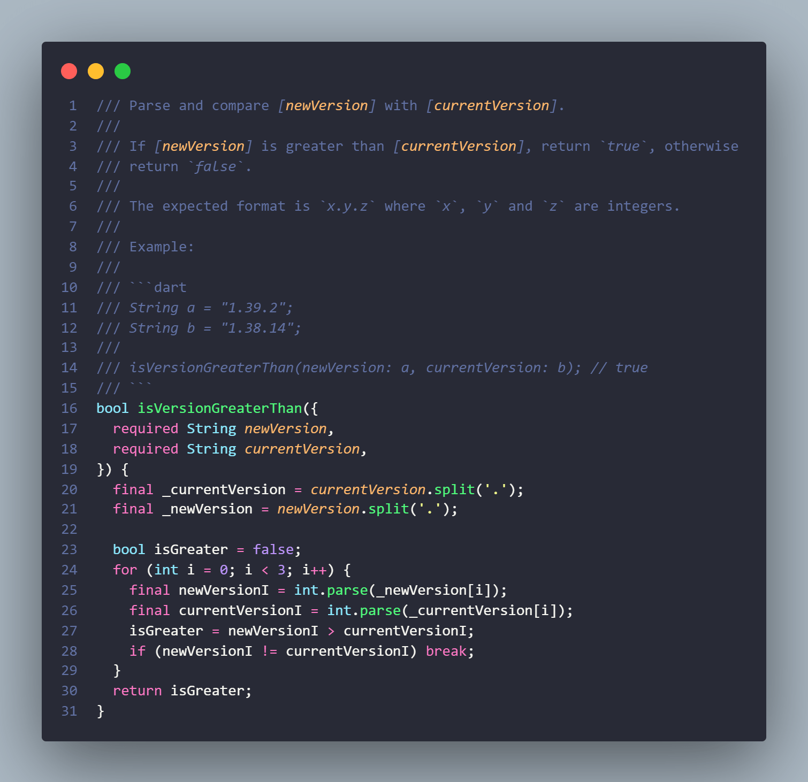

# Flutter Tips

Some tips and tricks in Flutter & Dart. 

**Inspired by [vandadnp's](https://github.com/vandadnp) repository [flutter-tips-and-tricks](https://github.com/vandadnp/flutter-tips-and-tricks)**

# Table of Contents

* [Compare two versions](#compare-two-versions)
* [Benchmark async method](#benchmark-async-method)
* [JSON decoding](#json-decoding)

# Compare two versions

[Source Code + Tests](source/is_version_greater_than.dart)

# Benchmark async method

[Source Code](source/benchmark_async.dart)

# JSON decoding

[Source Code + Tests](source/json_try_decode.dart)

