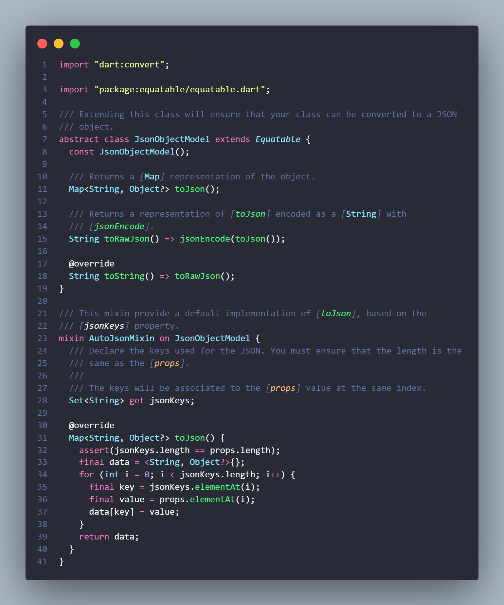
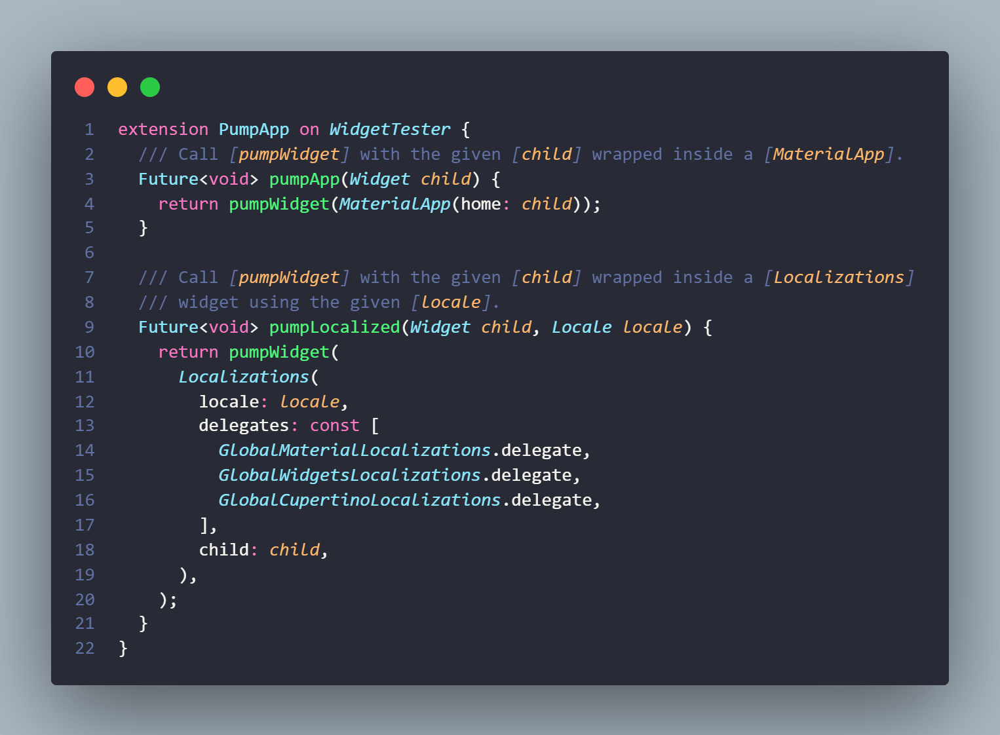
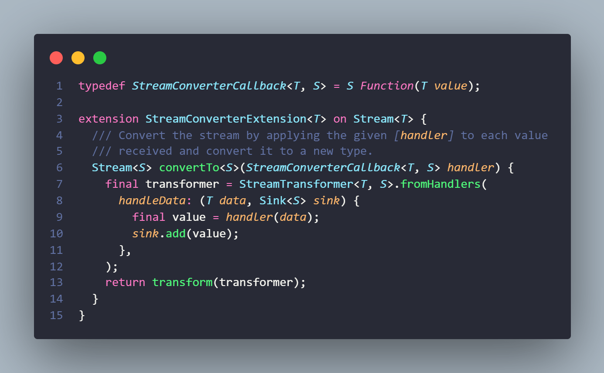
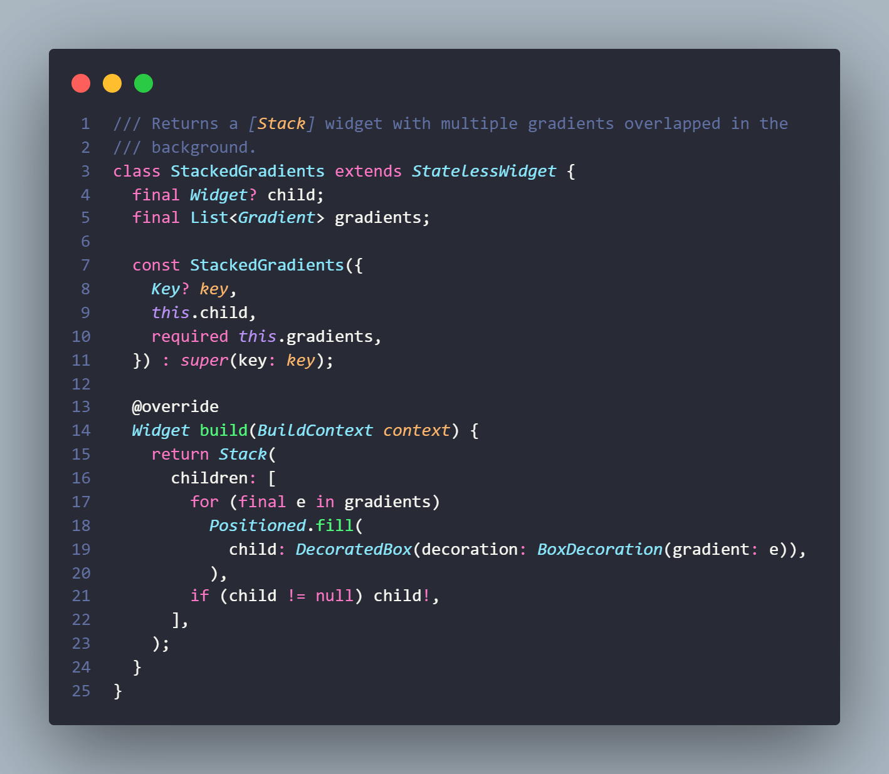

# Flutter Tips

Some tips and tricks in Flutter & Dart.

# Table of Contents

* [Translated Locale Name](#translated-locale-name)
* [Go Router Uri](#go-router-uri)
* [Json Object Model](#json-object-model)
* [Pump App Tester](#pump-app-tester)
* [Safe Complete](#safe-complete)
* [Stream Converter](#stream-converter)
* [String contains diacritics insensitive](#string-contains-diacritics-insensitive)
* [Stacked Gradients](#stacked-gradients)
* [Compare two versions](#compare-two-versions)
* [Benchmark async method](#benchmark-async-method)
* [JSON decoding](#json-decoding)

# Translated Locale Name

[Source code](source/translated_locale_name.dart)

# Go Router Uri

[Source code](source/go_router_uri.dart)

# Json Object Model

[Source Code](source/json_object_model.dart)

# Pump App Tester

[Source Code](source/pump_app_tester.dart)

# Safe Complete

[Source Code](source/safe_complete.dart)

# Stream Converter

[Source Code](source/stream_converter.dart)

# String contains diacritics insensitive

[Source Code + Tests](source/contains_no_diacritics.dart)

# Stacked gradients

[Source Code](source/stacked_gradients.dart)

[Try a demo](https://dartpad.dev/?id=0164591f591b08e52c6785307e52fd4f)

# Compare two versions

[Source Code + Tests](source/is_version_greater_than.dart)

# Benchmark async method

[Source Code](source/benchmark_async.dart)

# JSON decoding

[Source Code + Tests](source/json_try_decode.dart)

# Credits

* **Inspiration**: [vandadnp's](https://github.com/vandadnp) repository [flutter-tips-and-tricks](https://github.com/vandadnp/flutter-tips-and-tricks)
* **Code snippets**: [CodeSnap](https://marketplace.visualstudio.com/items?itemName=adpyke.codesnap)
